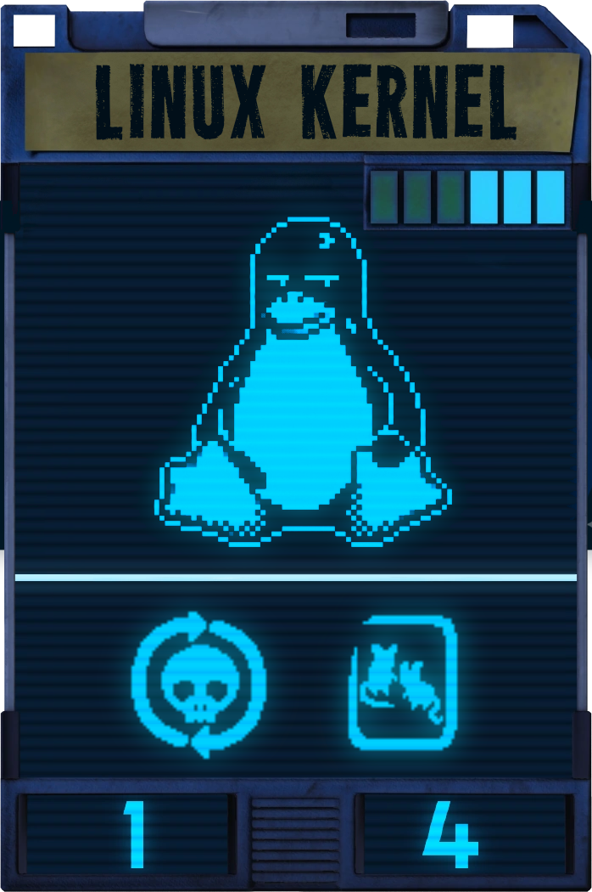

<div align="center">
  </img>
  <br/>
</div>

---

<div align="center">
  
  
  <p align="center">A zero-misplay kernel with CachyOS, TKG, Clear Linux patches and more, built from Fedora Koji SRPMs.</p>
</div>

<p align="center">This repository provides a set of tools to automatically build patch and compile the Linux Kernel from Fedora Koji SPRMs, with a selection of patches and configurations aiming for a better system responsiveness.</p>

---

<div align="center">
  </img>
  <h4>W H Y ?</h4>
</div>

<div align="center">
  <p><i>Why P03? He is a character defined by obsessive optimization — he takes something already functional and tears it apart, rebuilds it piece by piece, and won't stop until it performs exactly the way he envisions. That's precisely what this kernel is: Fedora's solid, well-tested base, stripped down and reassembled with handpicked patches, a custom scheduler, compiler optimizations, and configurations that the stock kernel would never ship. It's not built for everyone. It's built to be exactly what it needs to be.</i></p>
</div>


<div align="center">
  <h1>✨</h1>
  <h4>F E A T U R E S</h4>
</div>

 - Built on top of Fedora Koji Sources with Fedora's baseconfigs
 - Automatic Secureboot Signing (For nvidia drivers too!)
 - NVIDIA-Open Kernel Modules support
 - ThinLTO or FullLTO (Copr builds are ThinLTO)
 - LRU-Marie
 - Per-CPU ISA Optimizations (Copr only provides Generic x86-64v3)
 - 1000hz tickrate
 - Built with LLVM + O3 + Polly Clang
 - BORE scheduler
 - BBRv3 congestion control and FQ qdisk
 - OpenRGB Support
 - xConfig and nConfig during build
 - ADIOS I/O Scheduler
 - Piece-Of-Cake (POC) CPU Selector
 - Dynamic PREEMPT (Lazy by default)
 - Passive intel_pstate
 - Catastrophic Misplay Screen: A custom P03-themed QR-Code panic screen for those rare, fatal errors.

<div align="center">
  <h1>🔨</h1>
  <h4>B U I L D I N G</h4>
</div>

The [specfile](https://github.com/CatPieLeaf/linux-p03/blob/main/sources/kernel-p03/kernel-p03.spec) is packed with toggles — compiler, LTO mode, optimization level, tickrate, ISA level, Secure Boot, NR_CPUS, and more. Feel free to edit it before building. In particular, setting `_interactive_config 1` launches `xconfig` mid-build so you can tweak every single Kconfig option by hand before compilation starts.


> [!NOTE]
> Building the kernel takes **1–2 hours** depending on your hardware. A full build requires ~10 GB of free disk space. See the RAM tip in step 6 to avoid writing to disk entirely.

### 1 - Prerequisites

Install the RPM development tools if you don't have them yet:

```bash
sudo dnf install rpmdevtools
```

### 2 - Initialize the rpmbuild tree

This creates the standard `~/rpmbuild/{BUILD,RPMS,SOURCES,SPECS,SRPMS}` folder structure. Only needed once.

```bash
rpmdev-setuptree
```

### 3 - Download and place the spec file

```bash
wget https://raw.githubusercontent.com/CatPieLeaf/linux-p03/refs/heads/main/sources/kernel-p03/kernel-p03.spec -O ~/rpmbuild/SPECS/kernel-p03.spec
```

### 4 - Install all build dependencies

Reads every `BuildRequires` from the spec and installs them automatically:

```bash
sudo dnf builddep ~/rpmbuild/SPECS/kernel-p03.spec
```

### 5 - Download sources and patches

Downloads all URLs listed as `Source:` and `Patch:` entries into `~/rpmbuild/SOURCES/`.
The Fedora kernel SRPM itself is fetched automatically from Koji during the build — no extra step needed.

```bash
spectool -g -R ~/rpmbuild/SPECS/kernel-p03.spec
```

### 6 - Build

```bash
rpmbuild -bb ~/rpmbuild/SPECS/kernel-p03.spec
```

Output RPMs land in `~/rpmbuild/RPMS/x86_64/`. Install them with:

```bash
sudo dnf install ~/rpmbuild/RPMS/x86_64/kernel-p03-*.rpm
```

> [!TIP]
> Build in RAM to save SSD health (requires ~10 GB of free RAM). Run this **before** step 6:
> ```bash
> sudo mount -t tmpfs -o size=10G tmpfs ~/rpmbuild/BUILD
> ```

<div align="center">
  <h1>📦</h1>
  <h4>I N S T A L L A T I O N</h4>
</div>

Pre-built packages are available on [COPR](https://copr.fedorainfracloud.org/coprs/catpieleaf/kernel-p03/) — no need to build from source unless you want a custom configuration.

> [!WARNING]
> ## ⚙️ C P U  -  S U P P O R T
>
> ```
> /lib64/ld-linux-x86-64.so.2 --help | grep "(supported, searched)"
> ```
> If it does not detect x86_64_v3 support, do not install the default kernel. Otherwise, you will end up with a non-functioning operating system! You should install the gcc x86_64 v2 kernel by running `sudo dnf install kernel-p03-gcc`

## 🔵 F E D O R A  -  W O R K S T A T I O N

```bash
sudo dnf copr enable catpieleaf/kernel-p03
sudo dnf install kernel-p03
```
> [!WARNING]
> Run immediately after installation if using Secure Boot:
> ```bash
> sudo mokutil --import /etc/kernel/certs/p03-kernel/mok.der
> ```

## ⚪ F E D O R A  -  S I L V E R B L U E

```bash
sudo wget https://copr.fedorainfracloud.org/coprs/catpieleaf/kernel-p03/repo/fedora-$(rpm -E %fedora)/catpieleaf-kernel-p03-$(rpm -E %fedora).repo -O /etc/yum.repos.d/catpieleaf-kernel-p03.repo
```

```bash
sudo rpm-ostree override remove kernel kernel-core kernel-modules kernel-modules-core kernel-modules-extra --install kernel-p03
sudo systemctl reboot
```
> [!WARNING]
> Run immediately after installation if using Secure Boot:
> ```bash
> sudo mokutil --import /etc/kernel/certs/p03-kernel/mok.der
> ```

## 🟢 N V I D I A

```bash
sudo dnf install kernel-p03-nvidia-open
dnf info kernel-p03-nvidia-open
```

After installation, download and install the [NVIDIA driver](https://www.nvidia.com/en-us/drivers/unix/) matching the version shown by `dnf info` above.

> [!WARNING]
> Always install the NVIDIA driver with the flags below, otherwise it will try to build its own kernel modules and conflict with the ones already installed.
> ```bash
> sudo sh ./NVIDIA-Linux-x86_64-*.run --no-kernel-modules --no-dkms --no-nouveau-check
> ```

<div align="center">
  <h1>📑</h1>
  <h4>C R E D I T S</h4>
</div>

 - P03 and Inscryption are property of Daniel Mullins Games and Devolver Digital. This kernel is a non-commercial fan project and not affiliated with or endorsed by the original creators.
 - Patches and configuration files from [Linux-TKG](https://github.com/Frogging-Family/linux-tkg)
 - Patches from [Mauri870's Custom Kernel](https://github.com/mauri870/linux-kernel/)
 - Patches from [CachyOS Kernel](https://github.com/CachyOS/kernel-patches/)
 - Bore patches from [Firelzrd](https://github.com/firelzrd/bore-scheduler)
 - ADIOS patches from [Firelzrd](https://github.com/firelzrd/adios)
 - POC patches from [Firelzrd](https://github.com/firelzrd/poc-selector)
 - Kcompress-Unofficial patches from [Firelzrd](https://github.com/firelzrd/kcompressd-unofficial)
 - Le9uo patches from [Firelzrd](https://github.com/firelzrd/le9uo)
 - Based on the specfile from [CachyOS for Fedora COPR](https://github.com/CachyOS/copr-linux-cachyos)
 - ISA Patches from [graysky2](https://github.com/graysky2/kernel_compiler_patch)
 - LRU-Marie patches from [Firelzrd](https://github.com/firelzrd/lru_marie)

---

<div align="center">
  
  
</div>
