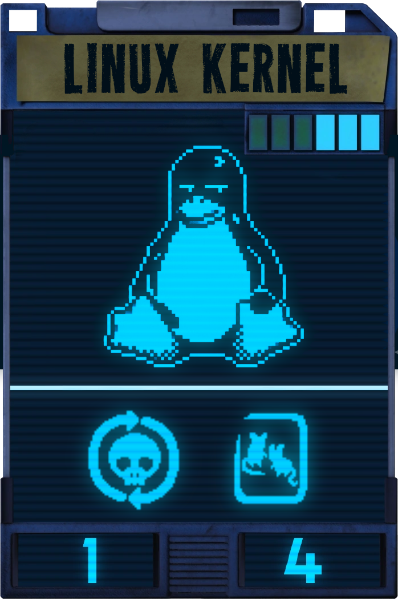

<div align="center">
  </img>
  <br/>
</div>

---

<div align="center">
  
  

<br>
<br>
<p align="center">
  
  <a href="https://discord.gg/DSrbRk6dPp"></a>
  <a href="https://copr.fedorainfracloud.org/coprs/catpieleaf/kernel-p03/"></a>
  <a href="https://build.opensuse.org/package/show/home:CatPieLeaf:kernel-p03/kernel-p03"></a>
  <a href="https://repo.rakuos.org/">
  </a>
</p>
  <p align="center">A zero-misplay kernel with Firelzrd, CachyOS, TKG, XanMod, Clear Linux patches and more, built from Fedora Koji and OpenSUSE SRPMs.</p>
</div>

<p align="center">This repository provides a set of tools to automatically build patch and compile the Linux Kernel from Fedora Koji and OpenSUSE SRPMs, with a selection of patches and configurations aiming for a better system responsiveness.</p>

<p align="center">Support server: <a href="https://discord.gg/DSrbRk6dPp">RakuOS Discord</a></p>

---

<div align="center">
  </img>
  <h4>W H Y ?</h4>
</div>

<div align="center">
  <p><i>Why P03? He is a character defined by obsessive optimization — he takes something already functional and tears it apart, rebuilds it piece by piece, and won't stop until it performs exactly the way he envisions. That's precisely what this kernel is: Fedora's and OpenSUSE's solid, well-tested base, stripped down and reassembled with handpicked patches, a custom scheduler, compiler optimizations, and configurations that aren't present on the stock kernel. It's built to be exactly what it needs to be.</i></p>
</div>


<div align="center">
  <h1>✨</h1>
  <h4>F E A T U R E S</h4>
</div>

 - Built on top of Fedora Koji and OpenSUSE's Sources with their respective baseconfigs
 - Local Automatic Secureboot Signing and Key generation (For nvidia drivers too!)
 - NVIDIA-Open Kernel Modules support
 - ThinLTO or FullLTO (Copr builds are ThinLTO)
 - LRU-Marie and Zram-IR
 - Nap CPUIdle governor
 - Per-CPU ISA Optimizations (Copr only provides Generic x86-64v3 and v2)
 - 750hz tickrate
 - Built with LLVM + O3 + Polly Clang + Mimalloc
 - BORE scheduler and Reflex CPU Governor
 - BBRv3 congestion control and FQ qdisk
 - OpenRGB Support
 - xConfig and nConfig during build
 - ADIOS I/O Scheduler
 - Handheld support (ROG Ally, Steam Deck, etc)
 - VHBA and AUFS support
 - Microsoft Surface support
 - Piece-Of-Cake (POC) CPU Selector
 - Dynamic PREEMPT (Lazy by default)
 - Passive intel_pstate and amd_pstate
 - Catastrophic Misplay Screen: A custom P03-themed QR-Code panic screen for those rare, fatal errors.
 - And many more!

---

<br>

<br>

<div align="center">
  
  
</div>

<div align="center">
  <p><i>A massive thank you to <b><a href="https://rakuos.org/">RakuOS</a></b> for adopting this project as their <b><a href="https://rakuos.org/kernel">default system kernel</a></b>!<br><br>
  Being chosen as the default kernel for an entire distribution is a huge honor. I am incredibly grateful to the RakuOS developers and community for their trust, valuable testing, and continuous support.

  For all those reading this, remember that P03 <u>is</u> and <u>will always be</u> Independent! Any distros are still totally welcome to adopt P03 as their default kernel!
  </i></p>
</div>

<div align="center">
  
  
</div>

<br>

<div align="center">
  <h1>🔨</h1>
  <h4>B U I L D I N G</h4>
</div>

The [specfile](https://github.com/CatPieLeaf/linux-p03/blob/main/sources/kernel-p03/kernel-p03.spec) is packed with toggles — compiler, LTO mode, optimization level, tickrate, ISA level, Secure Boot, NR_CPUS, and more. Feel free to edit it before building. In particular, setting `_interactive_config 1` launches `xconfig` mid-build so you can tweak every single Kconfig option by hand before compilation starts.


> [!NOTE]
> Building the kernel takes **1–2 hours** depending on your hardware. A full build requires ~10 GB of free disk space. See the RAM tip in step 6 to avoid writing to disk entirely.

### 1 - Prerequisites

Install the RPM development tools if you don't have them yet:

```bash
sudo dnf install rpmdevtools
```

### 2 - Initialize the rpmbuild tree

This creates the standard `~/rpmbuild/{BUILD,RPMS,SOURCES,SPECS,SRPMS}` folder structure. Only needed once.

```bash
rpmdev-setuptree
```

### 3 - Download and place the spec file

```bash
wget https://raw.githubusercontent.com/CatPieLeaf/linux-p03/refs/heads/main/sources/kernel-p03/kernel-p03.spec -O ~/rpmbuild/SPECS/kernel-p03.spec
```

### 4 - Install all build dependencies

Reads every `BuildRequires` from the spec and installs them automatically:

```bash
sudo dnf builddep ~/rpmbuild/SPECS/kernel-p03.spec
```

### 5 - Download sources and patches

Downloads all URLs listed as `Source:` and `Patch:` entries into `~/rpmbuild/SOURCES/`.
The Fedora kernel SRPM itself is fetched automatically from Koji during the build — no extra step needed.

```bash
spectool -g -R ~/rpmbuild/SPECS/kernel-p03.spec
```

### 6 - Build

```bash
rpmbuild -bb ~/rpmbuild/SPECS/kernel-p03.spec
```

Output RPMs land in `~/rpmbuild/RPMS/x86_64/`. Install them with:

```bash
sudo dnf install ~/rpmbuild/RPMS/x86_64/kernel-p03-*.rpm
```

> [!TIP]
> Build in RAM to save SSD health (requires ~10 GB of free RAM). Run this **before** step 6:
> ```bash
> sudo mount -t tmpfs -o size=10G tmpfs ~/rpmbuild/BUILD
> ```

<div align="center">
  <h1>📦</h1>
  <h4>I N S T A L L A T I O N</h4>
</div>

Pre-built packages are available on [COPR](https://copr.fedorainfracloud.org/coprs/catpieleaf/kernel-p03/) (Fedora) and [OBS](https://build.opensuse.org/package/show/home:CatPieLeaf:kernel-p03/kernel-p03) (openSUSE) — no need to build from source unless you want a custom configuration.

> [!WARNING]
> ## ⚙️ C P U  -  S U P P O R T
>
> ```
> /lib64/ld-linux-x86-64.so.2 --help | grep "(supported, searched)"
> ```
> If it does not detect x86_64_v3 support, do not install the default kernel. Otherwise, you will end up with a non-functioning operating system! You should install the gcc x86_64 v2 kernel by running `sudo dnf install kernel-p03-gcc`

## 🔵 F E D O R A  -  W O R K S T A T I O N

```bash
sudo dnf copr enable catpieleaf/kernel-p03
sudo dnf install kernel-p03
```
> [!WARNING]
> Run immediately after installation if using Secure Boot:
> ```bash
> sudo mokutil --import /etc/kernel/certs/p03-kernel/mok.der
> ```

## ⚪ F E D O R A  -  S I L V E R B L U E

```bash
sudo wget https://copr.fedorainfracloud.org/coprs/catpieleaf/kernel-p03/repo/fedora-$(rpm -E %fedora)/catpieleaf-kernel-p03-$(rpm -E %fedora).repo -O /etc/yum.repos.d/catpieleaf-kernel-p03.repo
```

```bash
sudo rpm-ostree override remove kernel kernel-core kernel-modules kernel-modules-core kernel-modules-extra --install kernel-p03
sudo systemctl reboot
```
> [!WARNING]
> Run immediately after installation if using Secure Boot:
> ```bash
> sudo mokutil --import /etc/kernel/certs/p03-kernel/mok.der
> ```

## 🦎 O P E N S U S E

```bash
sudo zypper addrepo https://download.opensuse.org/repositories/home:CatPieLeaf:kernel-p03/openSUSE_Tumbleweed/home:CatPieLeaf:kernel-p03.repo
sudo zypper refresh
sudo zypper install kernel-p03
```
> [!WARNING]
> Run immediately after installation if using Secure Boot:
> ```bash
> sudo mokutil --import /etc/kernel/certs/p03-kernel/mok.der
> ```

## 🟢 N V I D I A

```bash
sudo dnf install kernel-p03-nvidia-open
dnf info kernel-p03-nvidia-open
```

After installation, download and install the [NVIDIA driver](https://www.nvidia.com/en-us/drivers/unix/) matching the version shown by `dnf info` above.

> [!WARNING]
> Always install the NVIDIA driver with the flags below, otherwise it will try to build its own kernel modules and conflict with the ones already installed.
> ```bash
> sudo sh ./NVIDIA-Linux-x86_64-*.run --no-kernel-modules --no-dkms --no-nouveau-check
> ```

---
> [!WARNING]
> ## Disable systemd-oomd
> Disable or mask `systemd-oomd`. LRU-Marie already handles OOM promptly and correctly on its own; `systemd-oomd` misreads its proactive cache management as exhaustion and kills apps prematurely, or freezes the system.
> ```bash
> sudo systemctl disable --now systemd-oomd
> sudo systemctl mask systemd-oomd
> ```
> ⚠️ Very low-core / low-RAM machines: keep a PSI-based OOM daemon instead — Marie's mechanisms are kernel-side and can't help if CPU itself is saturated by compression.

<div align="center">
  <h1>📑</h1>
  <h4>C R E D I T S</h4>
</div>

 - P03 and Inscryption are property of Daniel Mullins Games and Devolver Digital. This kernel is a non-commercial fan project and not affiliated with or endorsed by the original creators.
 - Patches and configuration files from [Linux-TKG](https://github.com/Frogging-Family/linux-tkg)
 - Patches from [Firelzrd](https://github.com/firelzrd)
 - Patches from [Mauri870's Custom Kernel](https://github.com/mauri870/linux-kernel/)
 - Patches from [babiulep's Custom Kernel](https://github.com/babiulep/my-kernel-patches)
 - Patches from [CachyOS Kernel](https://github.com/CachyOS/kernel-patches/)
 - Patches from [XanMod Kernel](https://gitlab.com/xanmod/linux-patches)
 - Based on the specfile from [CachyOS for Fedora COPR](https://github.com/CachyOS/copr-linux-cachyos)
 - ISA Patches from [graysky2/kernel_compiler_patch](https://github.com/graysky2/kernel_compiler_patch)
 - Nap patches from [NikoMalik/nap](https://github.com/NikoMalik/nap/)
 - Surface patches from [Linux-surface](https://github.com/linux-surface/linux-surface)

---

<div align="center">
  
  
</div>
